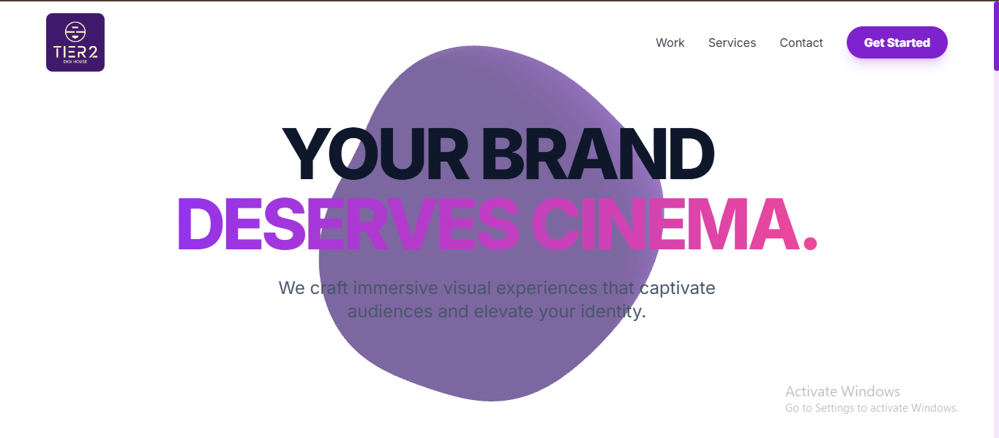
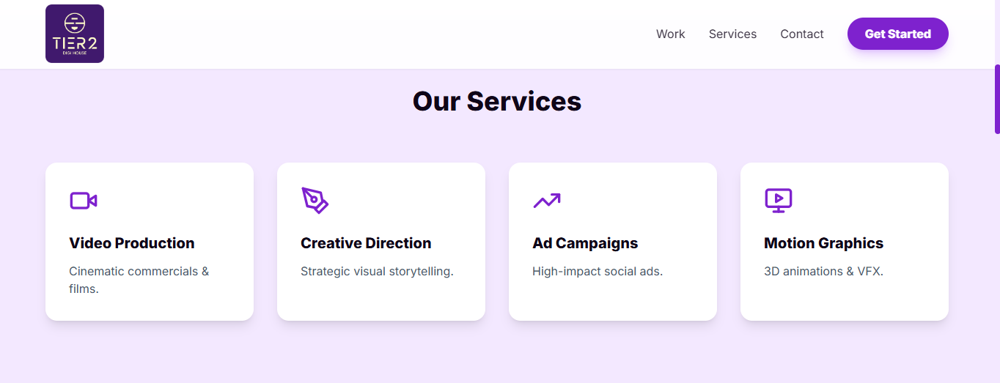
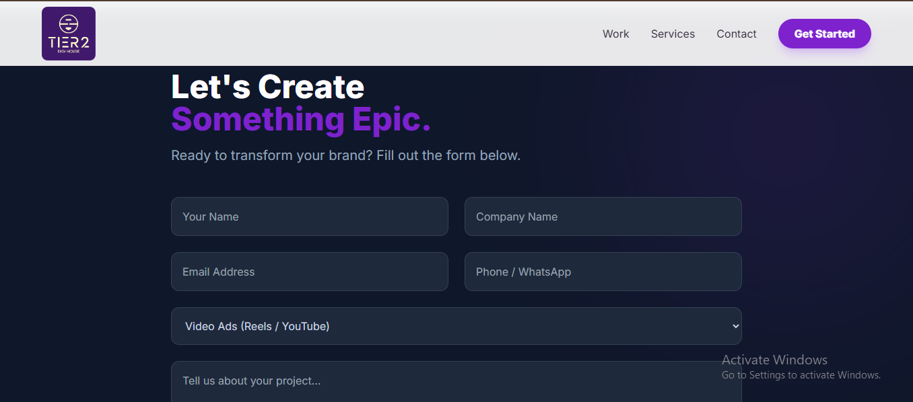

Tier 2 Digi House 🌐🎬

Tier 2 Digi House is a modern, full-stack digital agency website designed to showcase creative services such as video production, branding, advertising campaigns, and motion graphics. The platform provides a cinematic user experience with a responsive UI and a working contact system connected to a live backend and database.

🔗 Live Website:
👉 https://tier2digi-house2.vercel.app/

## 🖼 Screenshots

### 🏠 Home / Navbar

### 📝 Service Section

### 📞 Contact Section

🚀 Features

🎨 Frontend
Modern, responsive UI with smooth animations

Clean hero section with strong brand messaging

Services section highlighting core offerings

Interactive and user-friendly contact form

Optimized for desktop and mobile devices

⚙️ Backend

REST API built with Express.js

MongoDB Atlas for data storage

Contact form submissions stored securely in database

Ads / projects fetched dynamically from backend

🌐 Deployment

Frontend deployed on Vercel

Backend deployed on Render

Database hosted on MongoDB Atlas

🖼️ Website Sections (Based on UI)

1️⃣ Hero Section

Strong headline: “Your Brand Deserves Cinema.”

Brand-focused messaging with gradient text

Call-to-action button: Get Started

2️⃣ Services Section

Video Production

Creative Direction

Ad Campaigns

Motion Graphics

Each service is displayed using clean cards with icons and descriptions.

3️⃣ Contact Section

Fully functional contact form

Fields include:

  Name
  
  Company Name
  
  Email
  
  Phone / WhatsApp
  
  Service Type
  
  Project Description
  
  Form submissions are saved in MongoDB Atlas

🛠️ Tech Stack

  Frontend

  React (Vite)
  
  Tailwind CSS
  
  Framer Motion (animations)
  
  Lucide React (icons)
  
  Axios (API requests)
  
  Backend
  
  Node.js
  
  Express.js
  
  Mongoose
  
  MongoDB Atlas
  
  CORS
  
  dotenv

▶️ Running the Project Locally

1️⃣ Clone the Repository

git clone https://github.com/prathamesh4136/tier2digiHouse.git

2️⃣ Start Backend

cd server

npm install

npm run dev

Server runs on:

👉 http://localhost:5000

3️⃣ Start Frontend

cd client

npm install

npm run dev

Frontend runs on:

👉 http://localhost:5173
